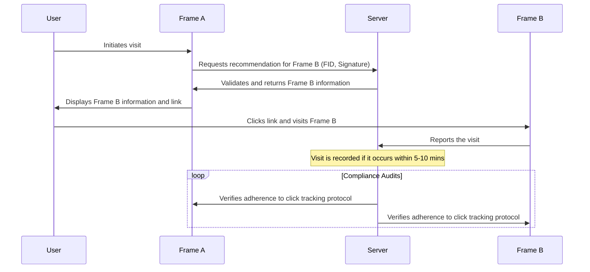

# Clicks Tracking

## Introduction

This document provides a detailed explanation of the click tracking system designed to monitor user navigation from one application (referred to as Frame A) to another (referred to as Frame B).

### Process Overview

1. **Initial User Visit to Frame A**: Upon the user's visit to Frame A, the application initiates a request to the central server for a recommendation to Frame B. This request includes the following data:
    - **FID**: A unique identifier assigned to the user.
    - **Signature**: A cryptographic signature that verifies the request, incorporating the exact time of the visit and the URL of Frame A.

2. **Verification by Server**: The server evaluates the request to ensure the integrity and authenticity of the provided signature and the validity of all included parameters.

3. **Server Response and Registration**: Subsequent to verification, the server responds to Frame A with detailed information about Frame B. Concurrently, the server records a potential redirection from Frame A to Frame B, valid for a timeframe of 5 to 10 minutes.

4. **Display of Frame B Information**: Frame A is responsible for presenting the information regarding Frame B to the user, including a navigational link to Frame B.

5. **Visitor Data Reporting**: It is mandatory for all participating applications to report their visitor statistics to the central server. This enables the tracking of incoming clicks, with a policy to disregard unregistered clicks.

6. **Compliance Verification**: The system conducts periodic reviews of each application to ensure adherence to the click tracking guidelines. This includes simulations with test users to audit the registration process. Applications failing to comply with these guidelines will be systematically excluded from the system.

### Sequence Diagram

* Frame Spec: https://docs.farcaster.xyz/reference/frames/spec
* Frame Signature: https://docs.farcaster.xyz/reference/frames/spec#frame-signature
* Frame Validator: https://warpcast.com/~/developers/frames
* Hub Protocol: https://docs.farcaster.xyz/hubble/hubble
